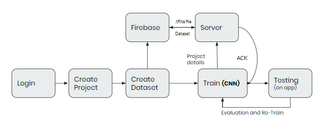
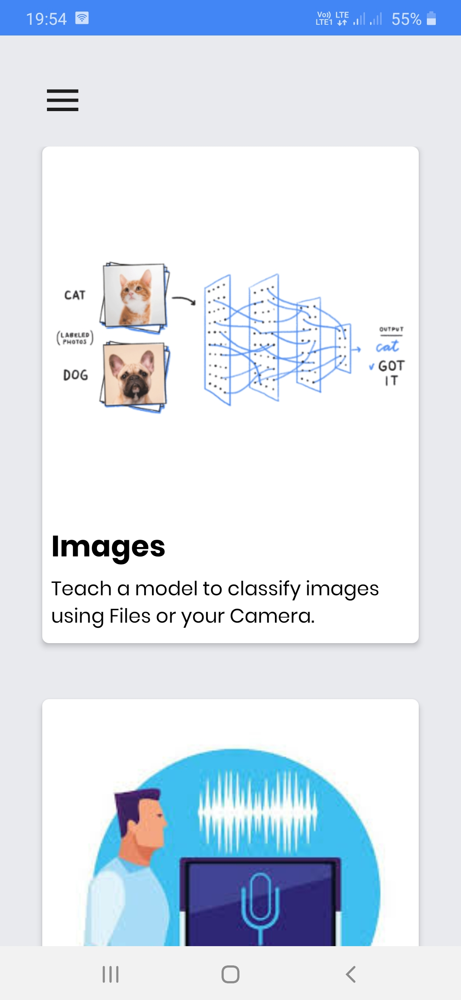
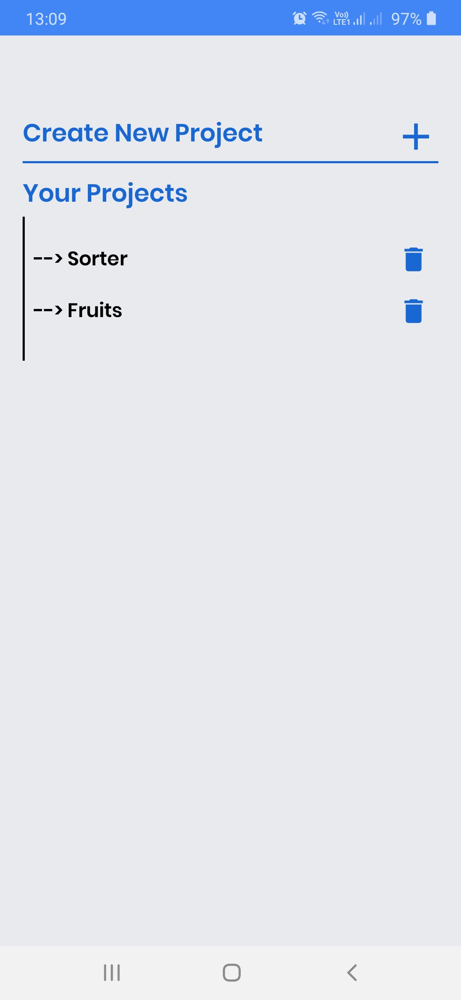
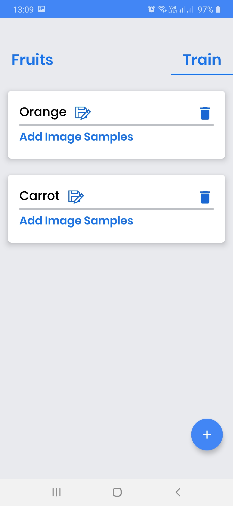
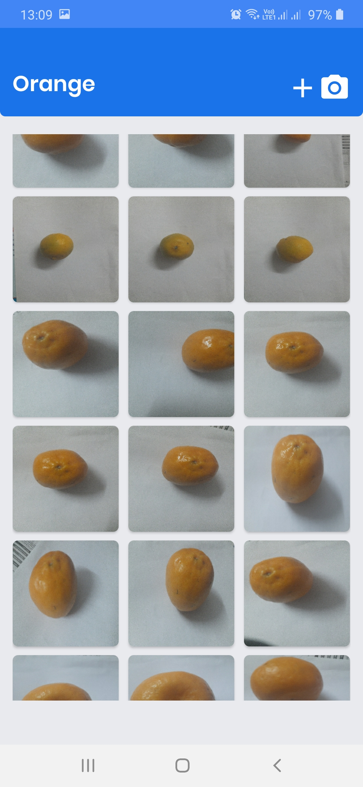
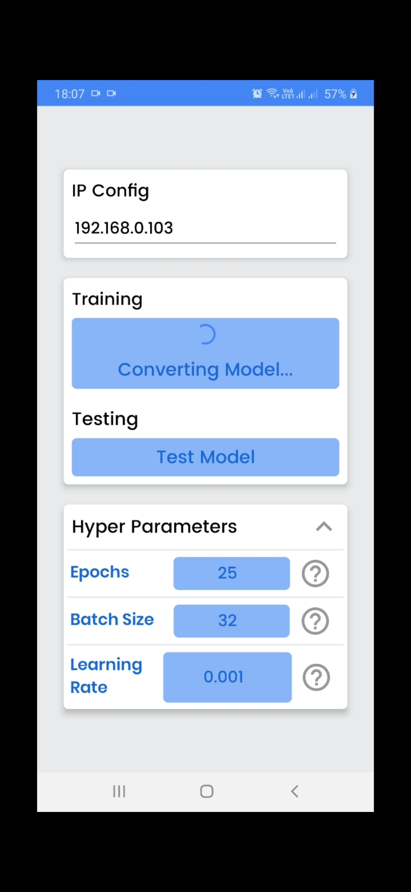
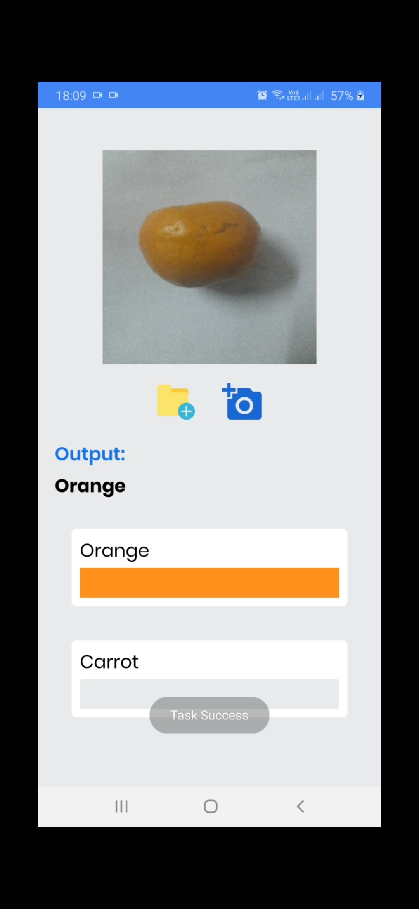
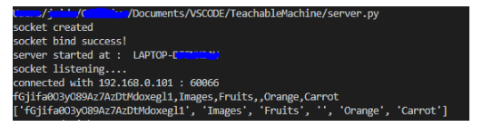
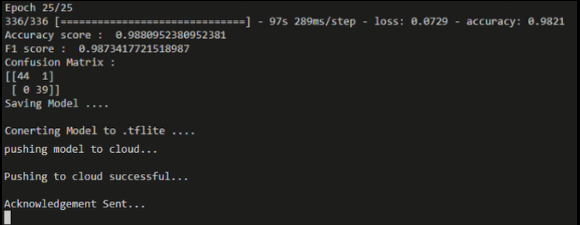

# Teachable Machine
An integrated application to avoid epidemics and for currently ending CoVID-19

__Motive__

The motive behind the project is the web-based teachable machine made by Google. We have developed the mobile version of the teachable machine to reach android users which improves both portability and ease of image capture through mobile. 

__Flow Chart__

__Technology Used__

1. Android(Java)
2. Convolutional Neural Networks
3. Keras
4. Data Augmentation
5. Socket Programming

__App Interface__

| Home Page | Projects |  Classes |
| ------------- | ------------- | ------------- |
|  |  |  |

| Dataset  | Train | Testing |
| ------------- | ------------- | ------------- |
|  |  |  |

__Terminal ( Server Verbose )__

__Socket Connection__

__Model Results__

__APK__ file is also added.
